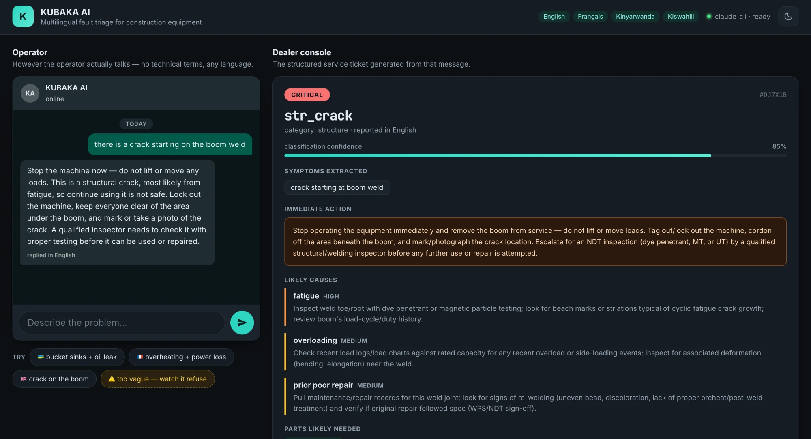
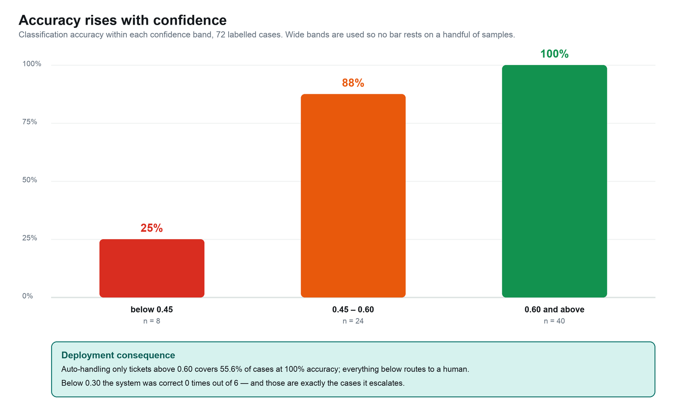
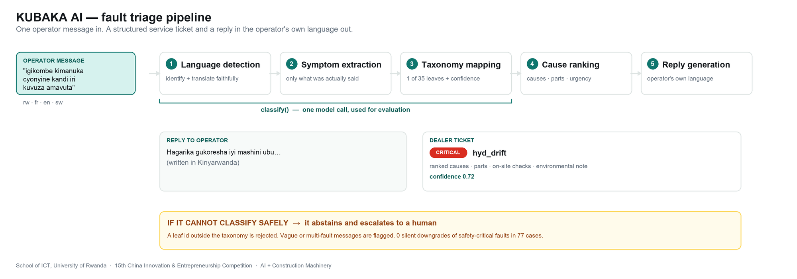

# KUBAKA AI

**Multilingual fault triage for construction equipment.**

An operator describes a problem in their own language — *"iri kuvuza amavuta kandi ukuboko kugenda buhoro"* — and KUBAKA AI returns a structured diagnosis: fault category, ranked causes, parts likely needed, urgency, and a service ticket the dealer can act on.

Built for the 15th China Innovation & Entrepreneurship Competition, **"AI + Construction Machinery"** Division — Professional Contest · Team Group · **AI + Operations**.

*Kubaka* means "to build" in Kinyarwanda.



*An English report classified as `str_crack` at critical urgency, 85% confidence — with lock-out instructions and an NDT inspection requirement. The operator sees a reply in their own language; the dealer sees a structured ticket.*

---

## Results

77 labelled test cases across English, French, Kinyarwanda and Swahili.

| Metric | Result |
|---|---|
| Language detection | **100.0%** (77/77) |
| Recall | **87.5%** (63/72) |
| Precision when it answers | **95.5%** (63/66) |
| Wrong | **4.2%** (3/72) |
| Correct abstention on vague input | **100.0%** (5/5) |

| Language | n | Recall | Precision | Abstain | Wrong |
|---|---|---|---|---|---|
| English | 39 | 92.3% | 94.7% | 2.6% | 2 |
| French | 12 | 100.0% | 100.0% | 0.0% | 0 |
| Kinyarwanda | 19 | 68.4% | 92.9% | 26.3% | 1 |
| Swahili | 2 | 100.0% | 100.0% | 0.0% | 0 |

Swahili has only 2 cases and supports no conclusion; it is listed for completeness.

### Safety-critical faults

8 of the 35 leaves carry a CRITICAL baseline — structural crack, brake failure, cylinder drift, thermal runaway, HV insulation. Of **21 such cases in the test set: 20 identified correctly, 1 escalated to a human, 0 misclassified, and 0 silent downgrades.** No safety-critical fault was ever quietly treated as routine.



**The headline finding is in the failure mode, not the accuracy.** On Kinyarwanda the system abstains 26.3% of the time but is 92.9% correct when it commits. The low-resource-language gap shows up as *appropriate uncertainty*, not confident error — the correct way to degrade in a domain where a missed structural crack or brake fault can kill someone. Confidence is meaningfully calibrated: mean 0.67 when correct, 0.50 when wrong.

## The problem

In emerging markets the bottleneck in equipment operations is not the machinery — it is language and diagnosis. A fault is noticed by an operator working in Kinyarwanda or Swahili, reported through a dealer operating in English or French, and resolved by a technician who needs structured technical information. Between those three, detail is lost. Machines sit idle, the wrong parts get ordered, and hydraulic leaks run for weeks.

## Approach

```
Operator message (rw / sw / fr / en)
        │
   [1]  language detection + faithful translation
   [2]  symptom extraction          → factual symptom phrases
   [3]  taxonomy mapping            → 1 of 35 leaf faults, with confidence
   [4]  cause ranking               → ranked causes, parts, urgency
   [5]  reply generation            → operator's own language
        │
        ├─→ reply to operator
        └─→ structured ticket to dealer
```



`classify()` runs steps 1–3 in a **single model call** — cheap enough to evaluate the whole test set. `triage()` runs the full flow for live use.

The pipeline **abstains rather than guesses**: vague or multi-fault messages are flagged `needs_human`. A leaf id the model invents that is not in the taxonomy is rejected and also treated as an abstention.

## Fault taxonomy

7 categories, 35 leaf faults — hydraulic, engine, undercarriage, electrical, transmission, structure & attachments, and **new-energy systems** (battery SOH, charging, thermal management, traction motor, HV safety).

Each leaf carries typical symptoms, known causes, likely parts, a baseline urgency, and — where genuine — an environmental note. Authored independently by the team from general engineering knowledge; contains no manufacturer-proprietary content.

## Setup

```bash
python3 -m venv .venv && source .venv/bin/activate
pip install -r requirements.txt
```

Then pick **one** backend. No paid API is required.

**Default — Claude Code subscription (no API key):**
```bash
npm install -g @anthropic-ai/claude-code
claude login
```

**Or Google AI Studio free tier (no credit card):**
```bash
pip install google-genai
cp .env.example .env     # set KUBAKA_BACKEND=gemini and GOOGLE_API_KEY
```

**Or the paid Anthropic API:**
```bash
pip install anthropic
cp .env.example .env     # set KUBAKA_BACKEND=anthropic and ANTHROPIC_API_KEY
```

## Run

```bash
# check the backend answers
python -c "from src.llm import health; print(health())"

# one message, full pipeline
python -m src.pipeline "the boom is leaking oil and moves slowly"

# demo interface  ->  http://localhost:8000
python -m app.server

# evaluation
python -m eval.run_eval --limit 5     # smoke test
python -m eval.run_eval               # full run, ~1 call per case
python -m eval.analyse                # re-analyse latest run, no model calls
```

## Evaluation method

`data/testset/cases.jsonl` holds 77 cases: 72 labelled, plus 5 traps that *should* be abstained on (one-word input, multiple unrelated faults, a pure self-diagnosis with no symptoms). It deliberately includes mixed-language messages, misleading descriptions where the operator blames the wrong component, and very short messages. The Kinyarwanda cases were written by a native speaker on the team.

`analyse.py` separates two failure modes that are not equivalent in a safety-critical domain:

- **WRONG** — the system committed to a classification and was incorrect
- **ABSTAIN** — the system declined and escalated to a human

### A note on labelling

An early run flagged *"it wont start, just clicks"* as a failure. On inspection the model was arguably right — a click with no crank is a battery signature, not a fuel fault. We adopted an explicit convention (no crank → electrical, cranks-but-won't-fire → engine) and corrected the labels. **We did not relabel after seeing results in order to raise the reported number.**

## Layout

```
data/taxonomy.json            fault taxonomy, 7 categories / 35 leaves
data/testset/cases.jsonl      77 labelled evaluation cases
data/testset/authoring/       scaffolding used to author the rw cases
src/pipeline.py               classify() and triage()
src/taxonomy.py               taxonomy loading and prompt rendering
src/llm.py                    pluggable backend (claude_cli | gemini | anthropic)
src/config.py                 configuration
eval/run_eval.py              evaluation run
eval/analyse.py               analysis: wrong vs abstained, per language
app/server.py                 demo server (standard library only)
app/static/                   demo front-end — responsive, light/dark
```

## Team

School of ICT, University of Rwanda, College of Science and Technology.

- **CYUZUZO PACIFIQUE** — pipeline, prompting, evaluation
- **MBABAZI PATRICK STRATON** — interface, deployment
- **IRUMVA GAD ANACLET** — test set, documentation

## Licence

All rights reserved by the team members. Submitted for competition evaluation.
